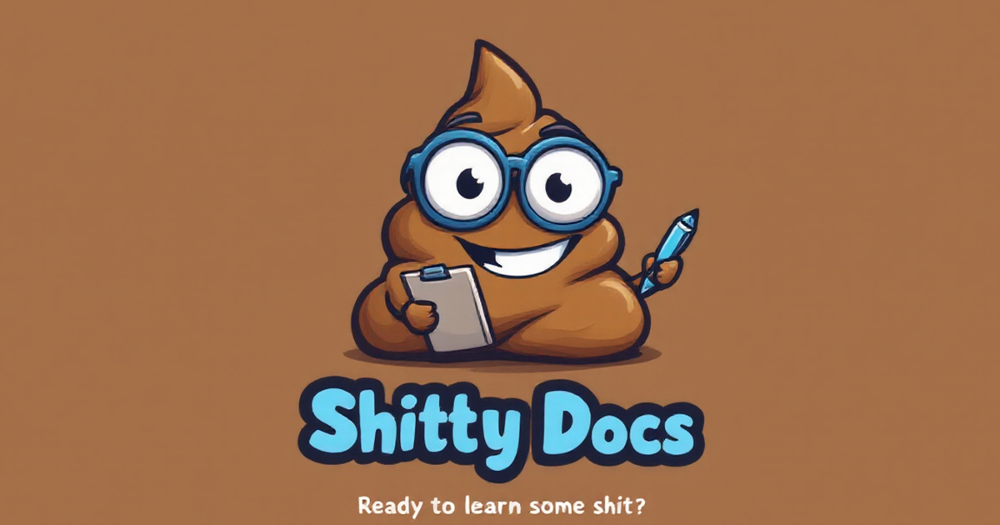

# 🚀 ShittyDocs - Learn Some Shit



ShittyDocs is a revolutionary documentation platform that transforms boring technical content into engaging, easy-to-understand explanations. No more wading through walls of formal, boring-ass text just to learn something new.

## 🌟 Features

- **No-Bullshit Explanations**: Get straight to the point without unnecessary jargon
- **Document Conversion**: Transform boring docs into entertaining reads
- **Web Page Processing**: Convert any webpage into our signature style
- **Multiple File Formats**: Support for .txt, .md, .doc, .docx, and PDF files
- **Fullscreen Mode**: Distraction-free reading experience
- **Mobile-Friendly**: Responsive design that works on all devices
- **Share & Download**: Easy sharing and downloading of processed content
- **Quick Topics**: One-click access to popular subjects

## 🛠️ Tech Stack

- **Frontend**: React 18 with TypeScript
- **AI Integration**: 
  - Google's Gemini AI
  - Groq
  - OpenAI (optional)
- **Styling**: Tailwind CSS with custom animations
- **Document Processing**: 
  - Mammoth.js for Word documents
  - PDF.js for PDF files
  - Native support for text and markdown
- **Routing**: React Router v6
- **Build Tool**: Vite

## 🚀 Getting Started

1. Clone the repository:
   ```bash
   git clone https://github.com/yourusername/shittydocs.git
   ```

2. Install dependencies:
   ```bash
   npm install
   ```

3. Set up environment variables:
   Create a `.env` file with:
   ```env
   # Required: At least one of these API keys based on your chosen provider
   VITE_GOOGLE_AI_API_KEY=your_gemini_api_key
   VITE_GROQ_API_KEY=your_groq_api_key
   VITE_OPENAI_API_KEY=your_openai_api_key
   ```

4. Configure your LLM provider:
   In `src/config/llmConfig.ts`, set your desired provider and model:
   ```typescript
   export const ACTIVE_PROVIDER: LLMProvider = 'google'; // or 'groq' or 'openai'
   ```

4. Start the development server:
   ```bash
   npm run dev
   ```

## 🔧 Available Scripts

- `npm run dev`: Start development server
- `npm run build`: Build for production
- `npm run preview`: Preview production build
- `npm run lint`: Run ESLint

## 📱 Features in Detail

### 1. Search Interface
- Dynamic placeholder suggestions
- Real-time AI-powered responses
- Fullscreen reading mode
- Copy and share functionality

### 2. Document Processing
- Multiple format support
- Intelligent content extraction
- Markdown output
- Download processed documents

### 3. Web Page Processing
- URL content extraction
- Smart content formatting
- Maintains important technical details
- Share processed pages

## 🎨 Design Philosophy

ShittyDocs follows these core principles:
1. **Clarity**: Cut through the bullshit
2. **Engagement**: Make learning fun and memorable
3. **Accessibility**: Easy to understand for everyone
4. **Efficiency**: Get to the point quickly
5. **Humor**: Because learning shouldn't be boring

## 🤝 Contributing

We welcome contributions! Please follow these steps:

1. Fork the repository
2. Create your feature branch (`git checkout -b feature/AmazingFeature`)
3. Commit your changes (`git commit -m 'Add some AmazingFeature'`)
4. Push to the branch (`git push origin feature/AmazingFeature`)
5. Open a Pull Request

## 📄 License

This project is licensed under the MIT License - see the [LICENSE](LICENSE) file for details.

## 🙏 Acknowledgments

- Made with 💚 by [GenAIJake](https://www.genaijake.com)
- Inspired by the need for better technical documentation
- Special thanks to all contributors and users

## 📬 Contact

For questions, feedback, or just to say hi:
- Twitter: [@YourTwitterHandle](https://twitter.com/YourTwitterHandle)
- Website: [shittydocs.com](https://shittydocs.com)

---

Version: 0.1.12